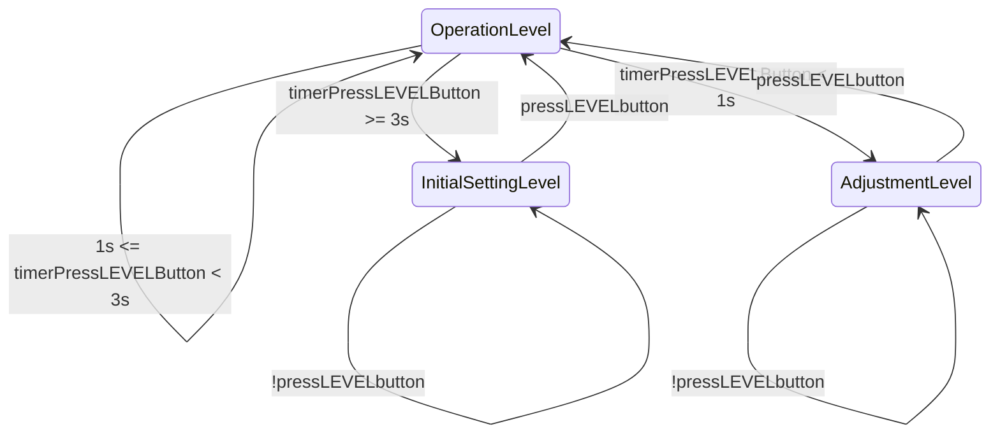
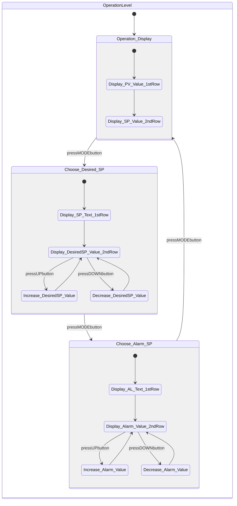
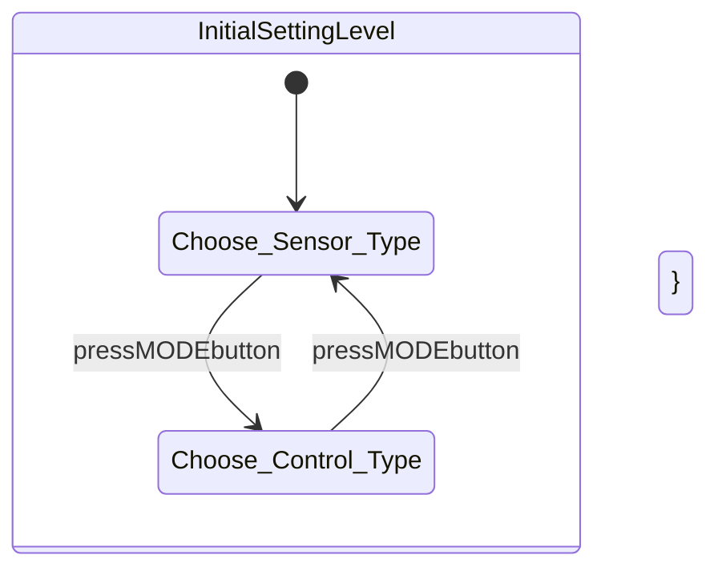
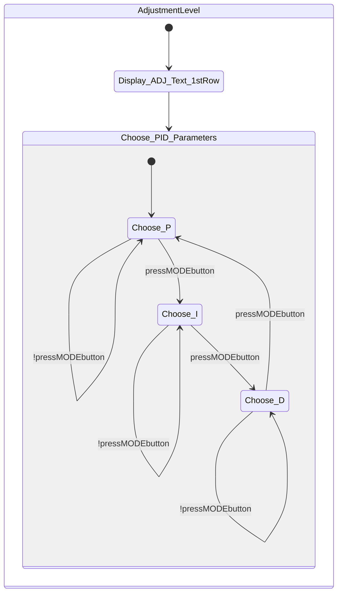
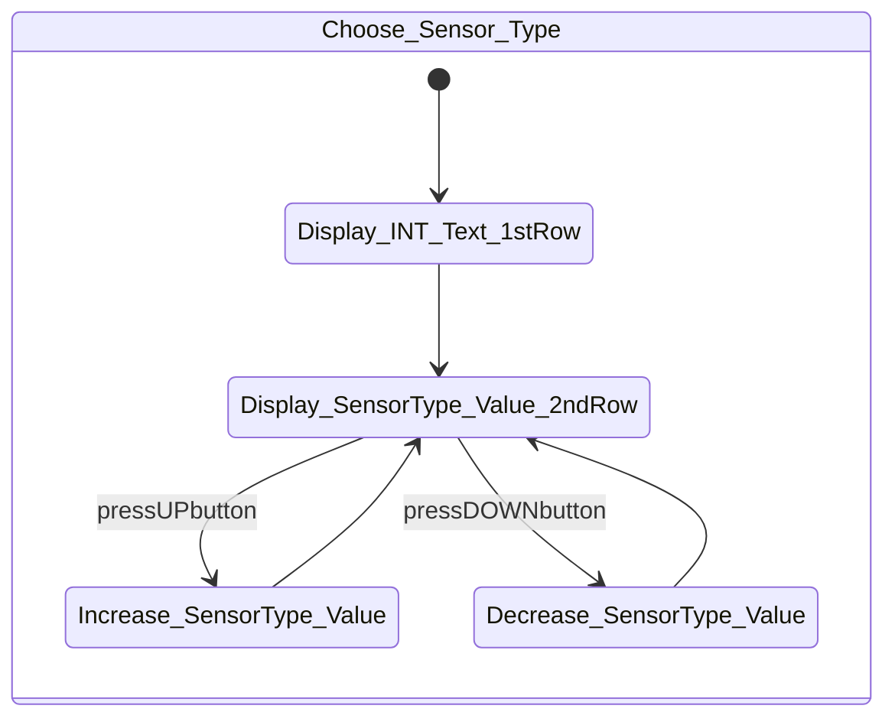
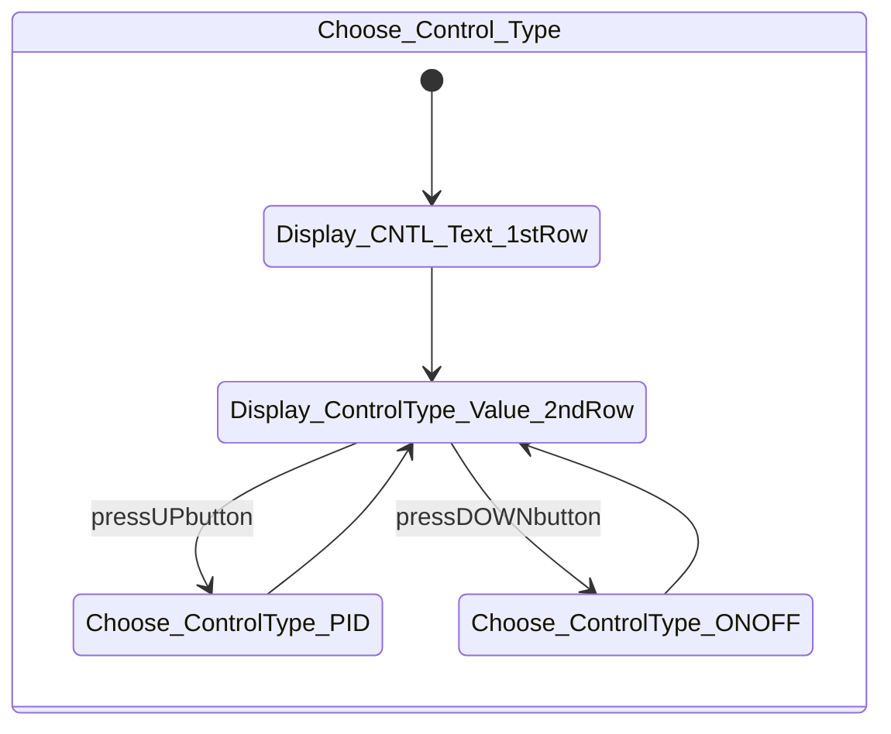
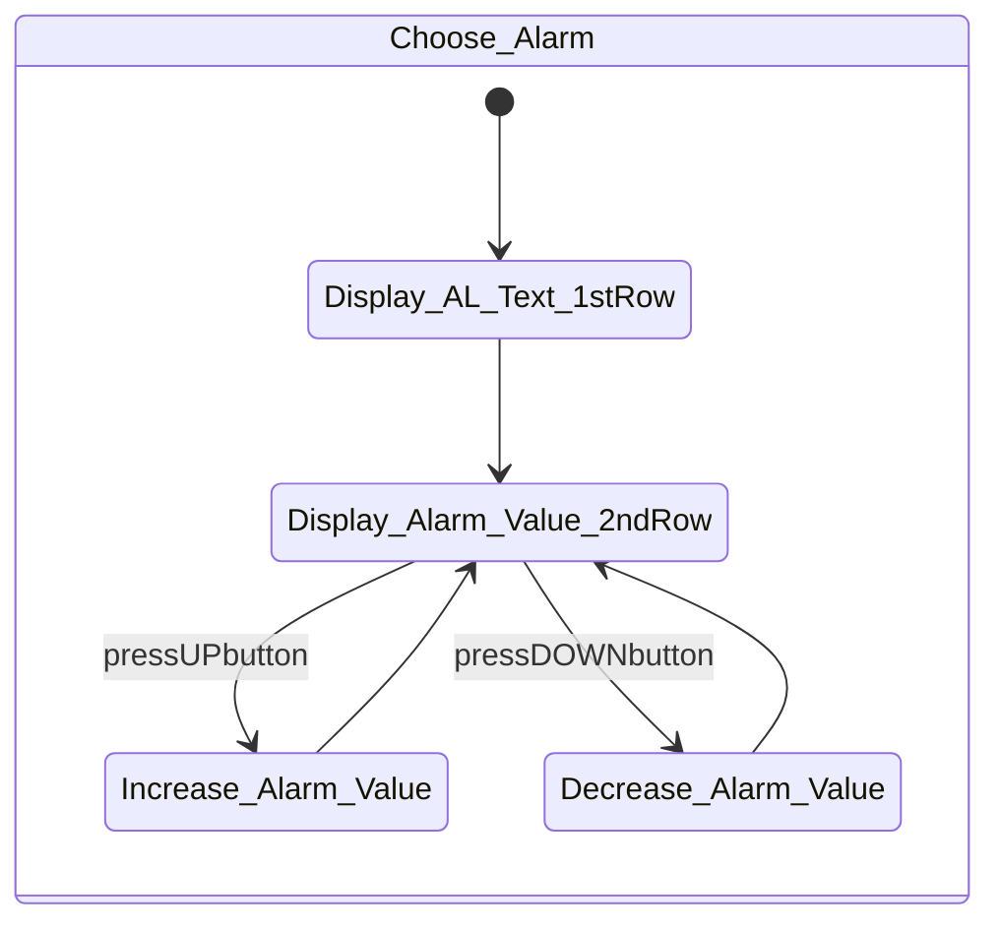
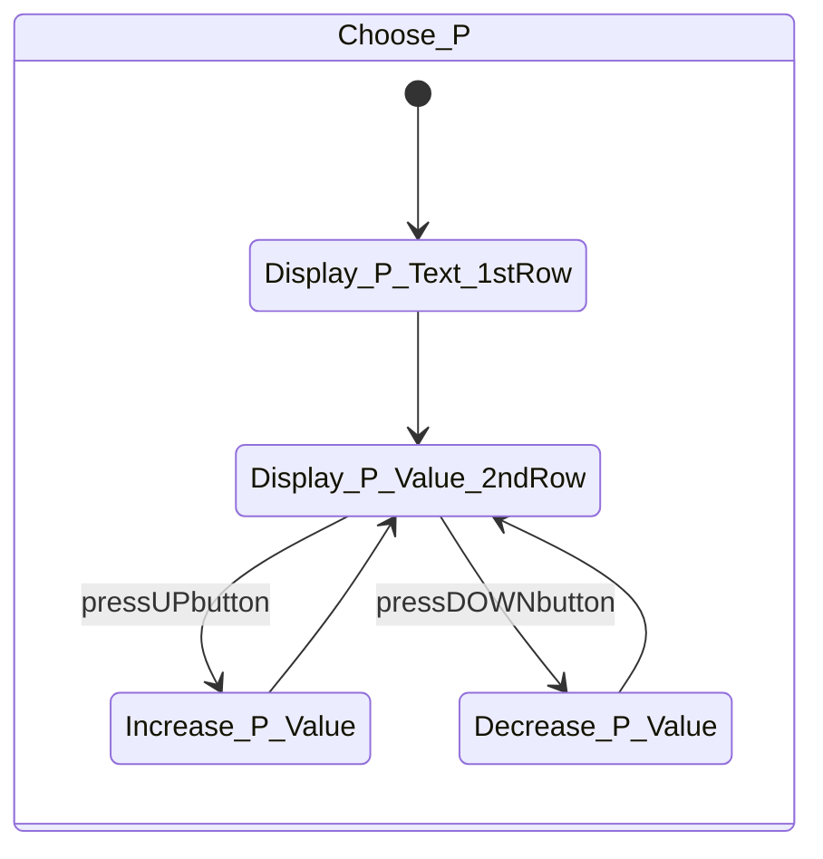
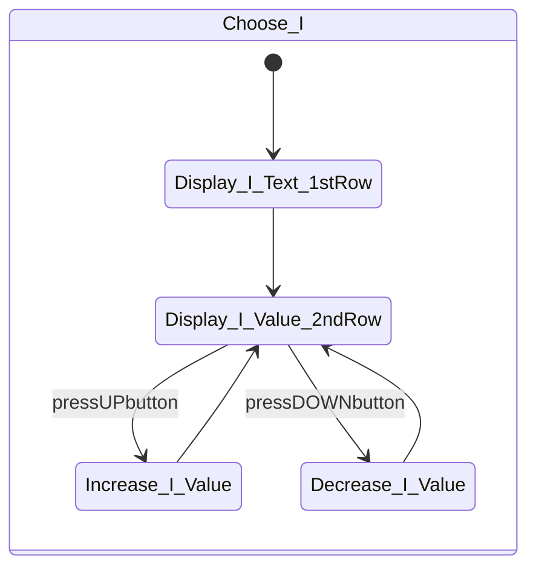
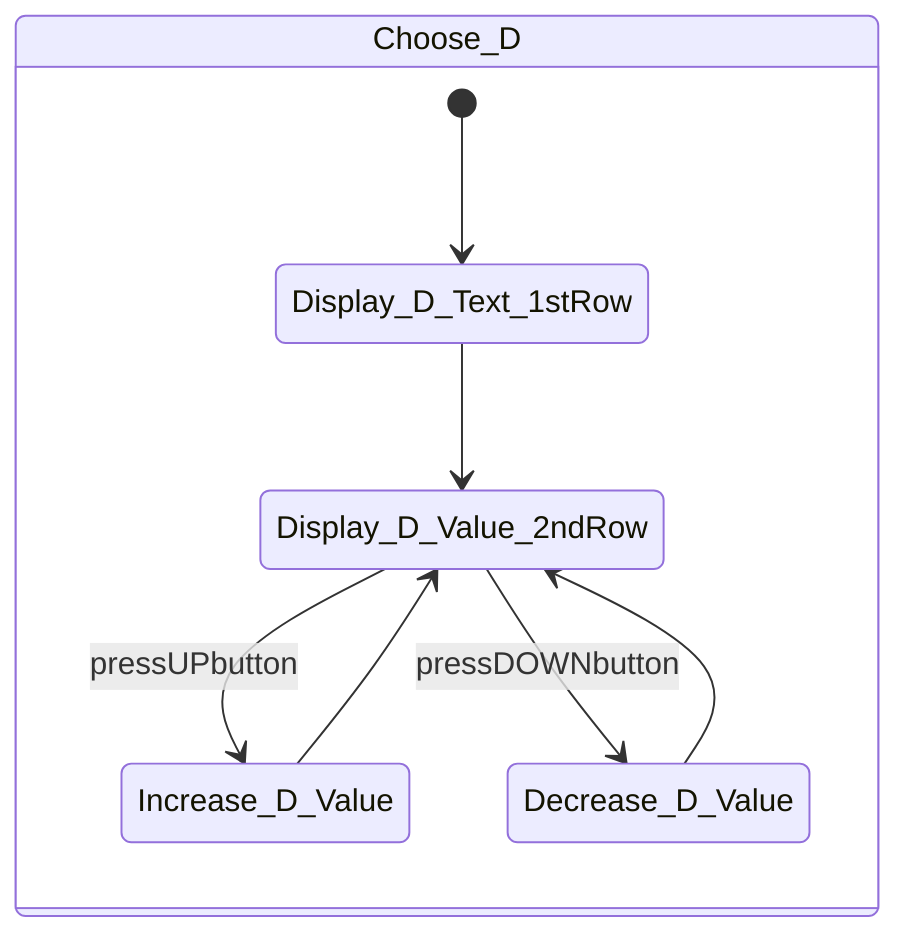

# Finite state machine of interface of temperature controller

## Finite State Machine

### Overall FSM

### 3 big levels

#### Operation Level

#### Initial Setting Level

#### Adjustment Level

### 3 small levels inside Initial Setting Level

#### Choose Sensor Type

#### Choose Control Type

#### Choose Alarm

### 3 small levels inside Adjustment Level

## Explanation

- The interface has 4 buttons named: LEVEL, MODE, UP, DOWN.
- There are 8 digits of 7-segment LED being used for display screen. These 8 digits are separated into 2 rows, each row has 4 digits. The 4 digits on the first row is for PV (Process \_Value = Actual and measured value) and the 4 digits on the second row is for SV (Set \_Value = Set and desired value).
- LEVEL button: Level setting selection
- MODE button: Parameter selection
- UP/DOWN button: Increase/Decrease the value of the selected parameter

### Operation

#### Setting the sensor type

To set the sensor type, you need to change the parameter IN-T (input type). Do this as follows:

1. Press the 1st button (LEVEL button) at least 3 seconds until IN-T is displayed.
2. The set value is indicated green and will default to 5.
3. If you are using a different sensor type, please enter the number corresponding to the sensor type used (these numbers are from 0 to 10).
4. You can change the value with the UP / DOWN button.
5. After changing the value, press the LEVEL button for 3 seconds again. If S-ERR is displayed on the controller, then the sensor has not been connected properly, the incorrect type has been selected, or the sensor has a malfunction.

#### Selecting PID or ON/OFF control

##### Setting UP as PID controller

By default, the controller is set as ON/OFF controller. If you like to use ON/OFF controller, you can skip this step.

To set the controller as PID controller, adjust the CNTL (control) parameter.

1. Press the 1st button (LEVEL button) for 3 seconds until IN-T is displayed on the first row of the display screen.
2. Then briefly press the 2nd button (MODE button) several times until CNTL is displayed on first row.
3. As you can see on second row, this parameter reads ONOF (ON-OFF). With the arrow UP button change this to PID (PID).
4. When finished, press the 1st button (LEVEL) again to return to the operation display. The controller is now set as PID controller

#### Setting the PID parameters manually

This device supports self-tuning only, not auto-tuning for PID parameters.

You set the PID constants manually in the Adjustment Level. The default settings of the PID constants are as follows: P (proportional band) = 8.0°C, I (integral time) = 233 seconds, D (derivative time) = 40 seconds.

1. Press LEVEL button for less than 1 second. L.ADJ will be displayed on first row to show that the Adjustment Level has been entered. The four numeric digits that identify the product code are displayed on second row.
2. Press MODE button several times to display P on first row. P indicates Proportional Band parameter. Default setting is 8.0 (shown on second row). You can change this value with UP/DOWN button.
3. Press MODE button several times to display I on first row. I indicates Integral Time parameter. Default setting is 233 (shown on second row). You can change this value with UP/DOWN button.
4. Press MODE button several times to display D on first row. D indicates Derivative Time parameter. Default setting is 40 (shown on second row). You can change this value with UP/DOWN button.

#### Selecting the Alarm value

1. Press and hold the 1st button (LEVEL) for 3 seconds until IN-T is displayed.
2. Press the 2nd button (MODE) several times to scroll through the parameters until you see AL (Alarm) displayed on the first row of the screen
3. You can change the alarm value on the second row with the UP and DOWN button.

#### Finish

At any stage above, if you wanna go back to the operation display to see the current temperature SV and PV, press the LEVEL button for 3 seconds.
