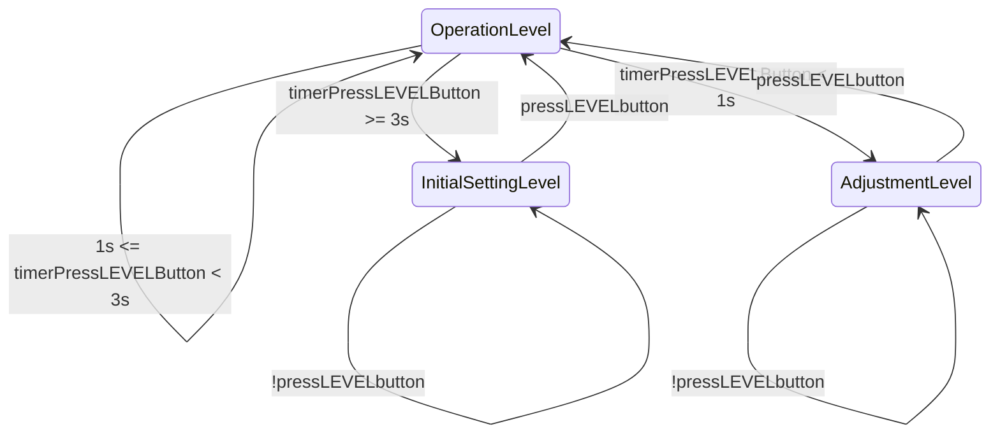
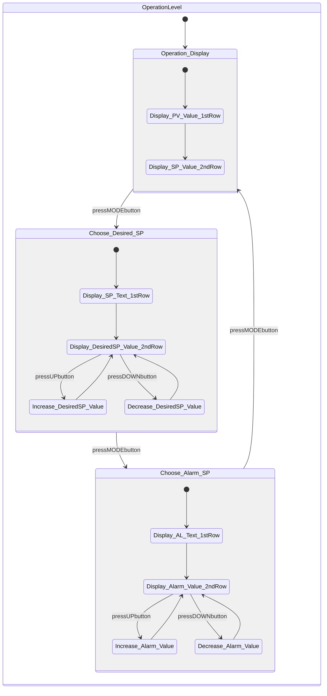
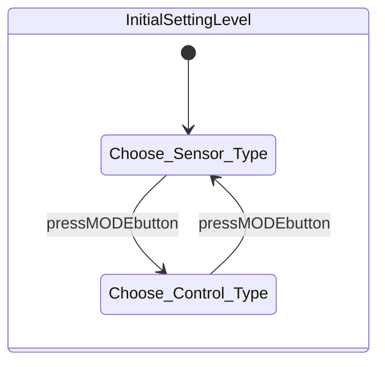
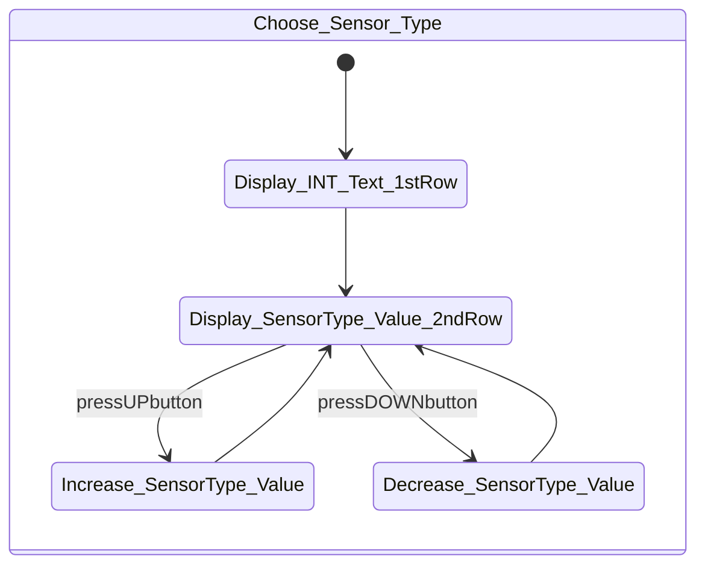
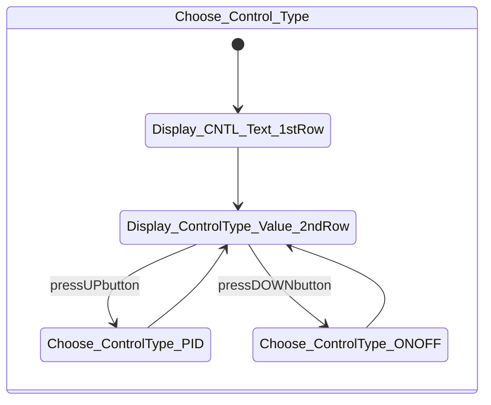
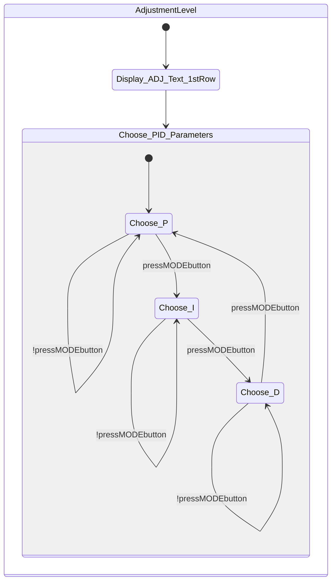
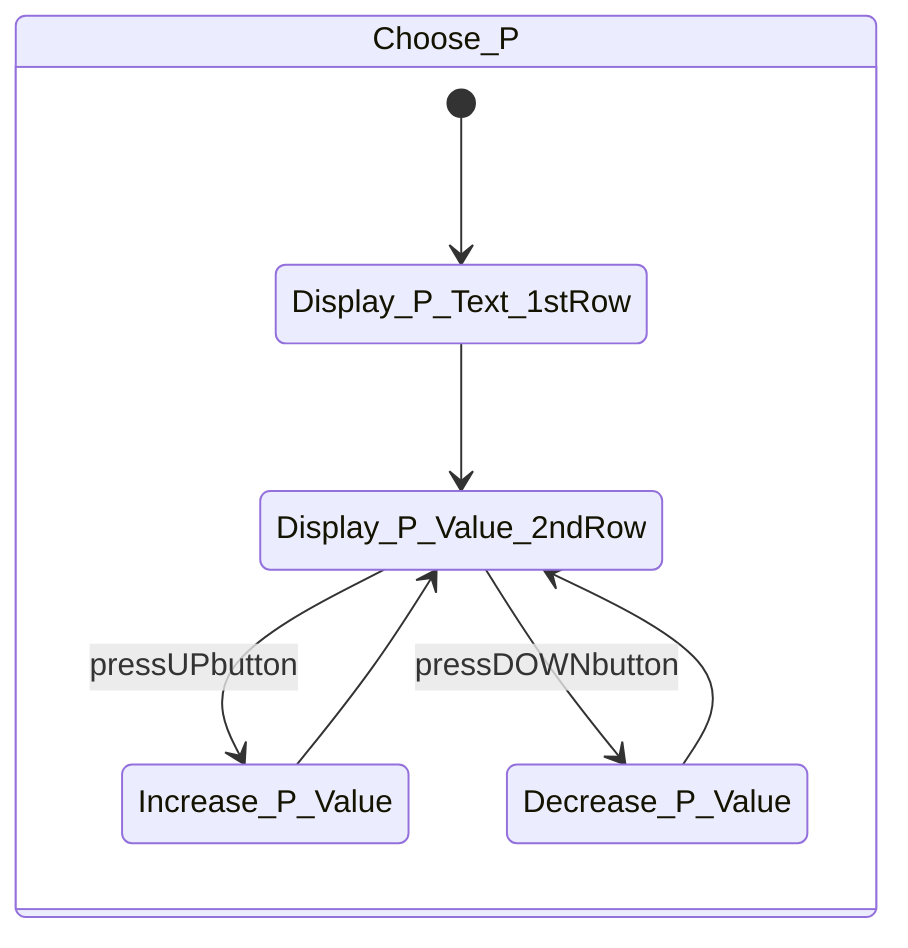
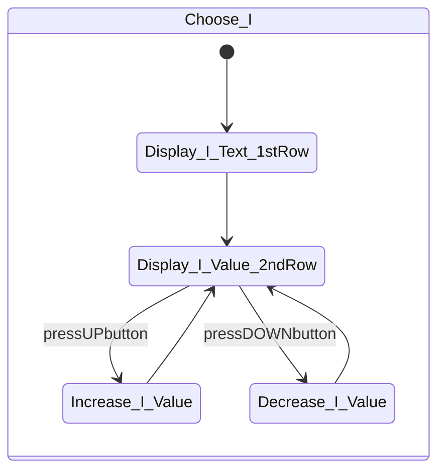
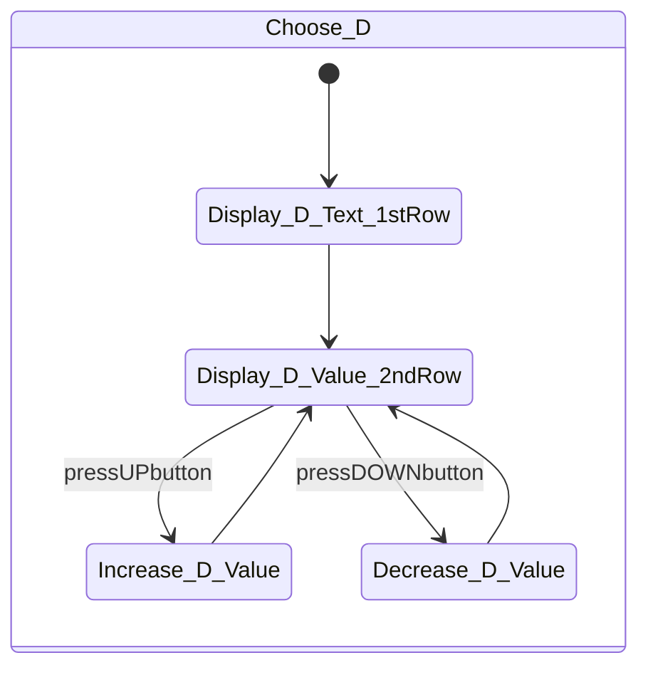

# Finite state machine of interface of temperature controller

## Finite State Machine

### Notation explanation

- Display\_{something}\_Text_1stRow: Display the text {something} on the 1st row of the display screen to indicate what parameter is being adjusted
- Display\_{something}\_Value_2ndRow: Display the numeric value associated to the parameter {something} on the 2nd row of the display screen

### Overall FSM

### Operation Level

### Initial Setting Level

#### Choose Sensor Type

#### Choose Control Type

### Adjustment Level

#### Choose P

#### Choose I

#### Choose D

## Explanation

- The interface has 4 buttons named: LEVEL, MODE, UP, DOWN.
  - LEVEL button: Change between Level settings
  - MODE button: Change between Parameter settings in a Level
  - UP/DOWN button: Increase/Decrease the value of the selected parameter
- There are 8 digits of 7-segment LED being used for display screen. These 8 digits are separated into 2 rows, each row has 4 digits.

### Setting the sensor type

To set the sensor type, you need to change the parameter INT (input type). Do this as follows:

1. Press LEVEL button for at least 3 seconds until "INT" is displayed on 1st row.
2. The value on 2nd row defaults to 5.
3. If you are using a different sensor type, please enter the number corresponding to the sensor type used. Use the reference table below.
4. You can change the value with the UP / DOWN button.

### Selecting PID or ON/OFF control

#### Setting up as PID controller

The control type is defaulted to ON/OFF. If you like to use ON/OFF, you can skip this step.

To set the control type as PID (you have to set P, I, D parameters manually later on), adjust the CNTL (control) parameter.

1. Press LEVEL button for at least 3 seconds until "INT" is displayed on the 1st row of the display screen.
2. Then press MODE button until "CNTL" is displayed on 1st row.
3. As you can see on 2nd row, the value for CNTL parameter is "ONOF" (ON-OFF). With the UP button change this to "PID".
4. When finished, press LEVEL button again to return to the operation display.

#### Setting the PID parameters manually

Set the P, I, D parameters manually in the Adjustment Level. Their default values are:

- Proportional band in °C: P = 8
- Integral time in seconds: I = 233
- Derivative time in seconds: D = 40

1. Press LEVEL button for less than 1 2nd. "ADJ" will be displayed on 1st row to show that the Adjustment Level has been entered.
2. Press MODE button to display P parameter on 1st row. You can change the value (shown on 2nd row) of this parameter with UP/DOWN buttons.
3. Similarly, you can change the values of I and D parameters by pressing MODE button to scroll through the parameters.

### Selecting the Alarm value

1. Press LEVEL button for 3 seconds until "INT" is displayed on 1st row.
2. Press MODE button several times until you see "AL" (Alarm) displayed on the 1st row of the screen
3. You can change the alarm value on the 2nd row with the UP and DOWN button.

### Finish

At any stage above, if you wanna go back to the operation display to see the current temperature SV and PV, press the LEVEL button for at least 3 seconds.
