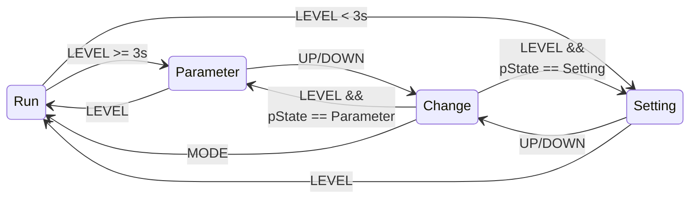
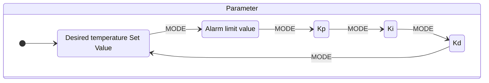
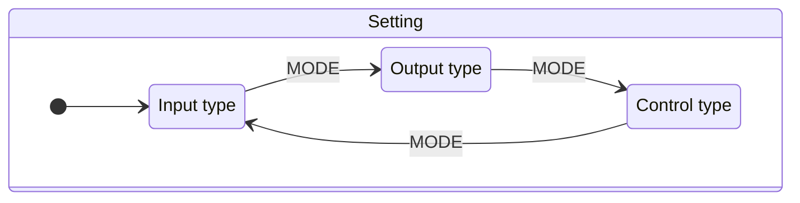
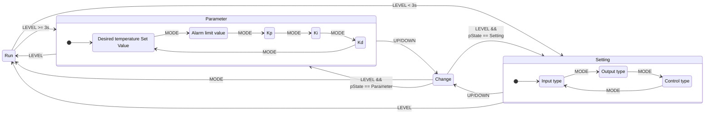

# Interface Diagrams

```mermaid
stateDiagram-v2
direction LR

    %% states
    run: Run
    param: Parameter
    change: Change
    setting: Setting
    %% Run: the system is running, SV and PV are displayed
    %% Parameter: the system is in parameter setting mode, Kp, Ki, Kd, SV, AL are displayed and can be selected to be changed in Change mode
    %% Change: the system is in parameter change mode, where the numeric values of parameters Kp, Ki, Kd, SV, AL can be changed
    %% Setting: the system is in setting mode, where the input, output, and control types can be selected to be changed in Change mode

    %% 4 buttons: LEVEL, MODE, UP, DOWN

    run --> param: LEVEL >= 3s
    run --> setting: LEVEL < 3s

    param --> change: UP/DOWN
    param --> run: LEVEL

    setting --> change: UP/DOWN
    setting --> run: LEVEL

    change --> param: LEVEL &&<br/>pState == Parameter
    change --> setting: LEVEL &&<br/>pState == Setting
    change --> run: MODE
```

```mermaid
stateDiagram-v2
state Parameter {
    direction LR
    sv: Desired temperature Set Value
    av: Alarm limit value
    [*] --> sv
    sv --> av: MODE
    av --> Kp: MODE
    Kp --> Ki: MODE
    Ki --> Kd: MODE
    Kd --> sv: MODE
}
```

```mermaid
stateDiagram-v2
state Setting {
    direction LR
    input: Input type
    output: Output type
    control: Control type
    [*] --> input
    input --> output: MODE
    output --> control: MODE
    control --> input: MODE
}
```

## Full diagram

```mermaid
stateDiagram-v2
direction LR

    %% states
    run: Run
    param: Parameter
    change: Change
    setting: Setting
    %% Run: the system is running, SV and PV are displayed
    %% Parameter: the system is in parameter setting mode, Kp, Ki, Kd, SV, AL are displayed and can be selected to be changed in Change mode
    %% Change: the system is in parameter change mode, where the numeric values of parameters Kp, Ki, Kd, SV, AL can be changed
    %% Setting: the system is in setting mode, where the input, output, and control types can be selected to be changed in Change mode

    %% 4 buttons: LEVEL, MODE, UP, DOWN

    run --> param: LEVEL >= 3s
    run --> setting: LEVEL < 3s

    param --> change: UP/DOWN
    param --> run: LEVEL

    setting --> change: UP/DOWN
    setting --> run: LEVEL

    change --> param: LEVEL &&<br/>pState == Parameter
    change --> setting: LEVEL &&<br/>pState == Setting
    change --> run: MODE

   state param {
    direction LR
    sv: Desired temperature Set Value
    av: Alarm limit value
    [*] --> sv
    sv --> av: MODE
    av --> Kp: MODE
    Kp --> Ki: MODE
    Ki --> Kd: MODE
    Kd --> sv: MODE
    }

    state setting {
    direction LR
    input: Input type
    output: Output type
    control: Control type
    [*] --> input
    input --> output: MODE
    output --> control: MODE
    control --> input: MODE
    }
```
