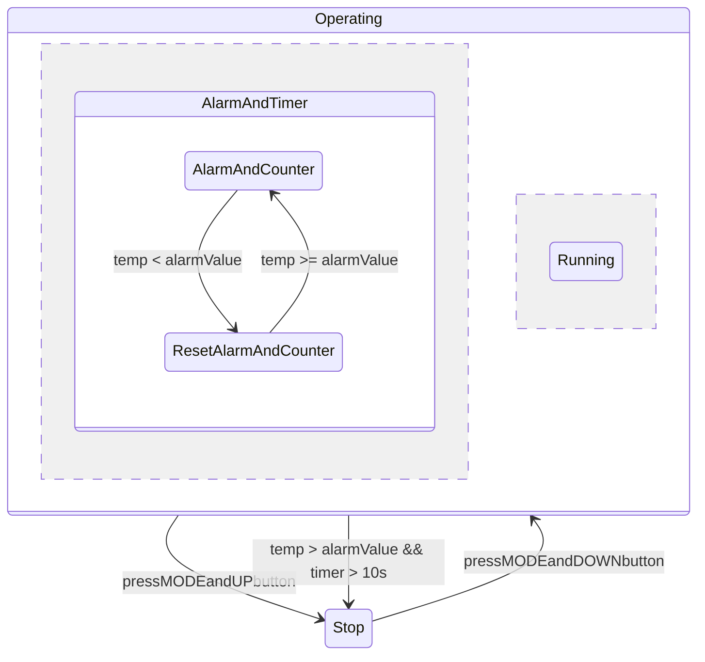

# FSM of Unit Control

```mermaid
stateDiagram-v2
    state Operating {
        state AlarmAndTimer {
            AlarmAndCounter --> ResetAlarmAndCounter: temp < alarmValue
            ResetAlarmAndCounter --> AlarmAndCounter: temp >= alarmValue
        }
        --
        Running
    }

    state Stop

    Operating --> Stop: pressMODEandUPbutton
    Stop --> Operating: pressMODEandDOWNbutton
    Operating --> Stop: temp > alarmValue && timer > 10s

```
