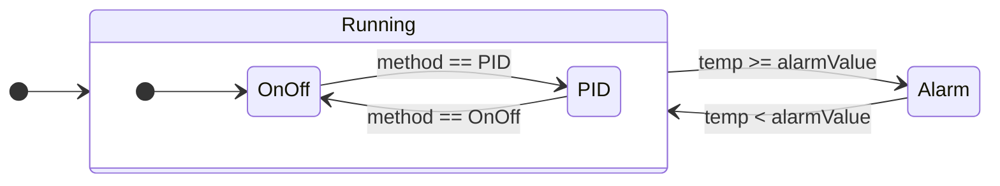

```mermaid
stateDiagram-v2
direction LR
    state Running {
    direction LR
        [*] --> OnOff
        OnOff --> PID: method == PID
        PID --> OnOff: method == OnOff
    }
    [*] --> Running
    Running --> Alarm: temp >= alarmValue
    Alarm --> Running: temp < alarmValue
```
